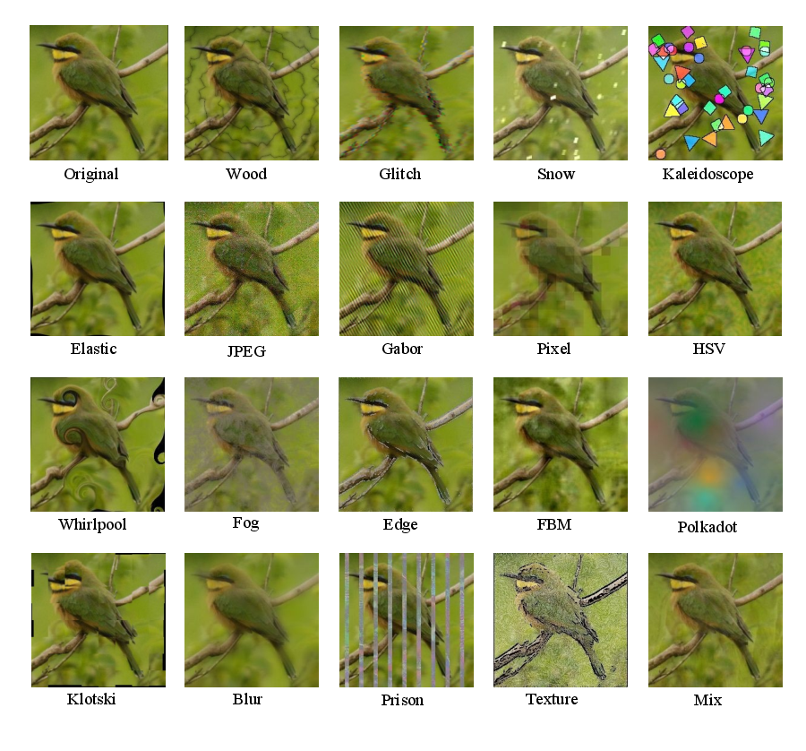
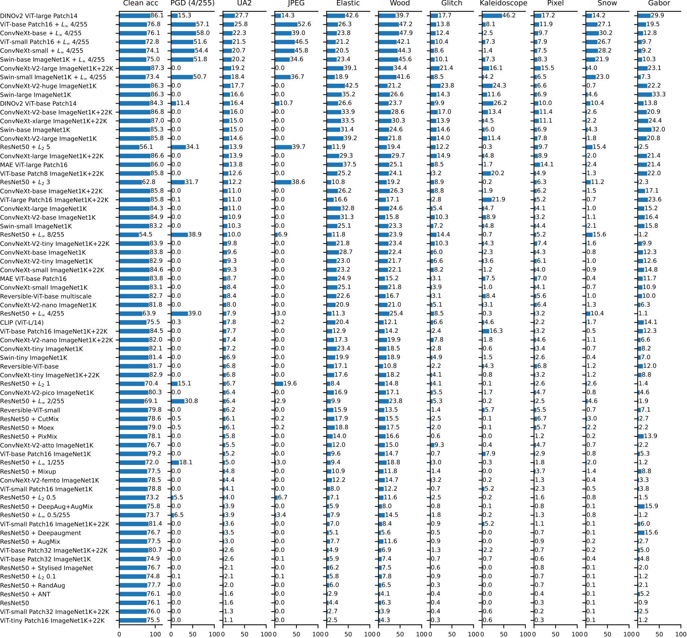

# Testing Robustness Against Unforeseen Adversaries <!-- omit from toc -->

This repository contains code for evaluating the robustness of image classifiers to a a variety of unforeseen adversaries, as presented in the forthcoming paper [*Testing Robustness Against Unforeseen Adversaries*](https://arxiv.org/abs/1908.08016). (This repository contains code for the updated version of ImageNet-UA. The code for the original version is at https://github.com/ddkang/advex-uar.)

<div align="center">
  
<p align="center">Samples of the unforeseen attacks</p>
</div>

- [Reproducibility](#reproducibility)
    - [Evaluation script](#evaluation-script)
- [Usage](#usage)
    - [Command-line interface for model evaluation](#command-line-interface-for-model-evaluation)
    - [Running a batch of experiments from a file](#running-a-batch-of-experiments-from-a-file)
    - [Logging](#logging)
- [Installation](#installation)
    - [Install dependencies](#install-dependencies)
    - [Datasets](#datasets)
    - [Model weights](#model-weights)
- [Extending the repository](#extending-the-repository)
    - [Adding Attacks](#adding-attacks)
    - [Adding Datasets](#adding-datasets)
    - [Adding New Architectures](#adding-new-architectures)
    - [Adding new models to the evaluations script](#adding-new-models-to-the-evaluations-script)
- [Citation](#citation)


## Reproducibility 

<div align="center">

  
    <p align="center">Comparisons of the Unforeseen Adversarial Accuracy (UAA) of a range of baseline models on ImageNet-UA. See the paper for full results. </p>
</div>

### Evaluation script

To ensure the reproducibility of our results, we include the ``eval.sh`` script, which allows for the recreation of our results from the paper.

```
bash eval.sh imagenet
bash eval.sh imagenet100
bash eval.sh cifar10
```

The above evaluates ImageNet, ImageNet100, and CIFAR-10 respectively.
Use `experiments/eval_imagenet.ipynb`, `experiments/eval_imagenet100.ipynb`, and `experiments/eval_cifar10.ipynb` to render the above results into bar plots as shown in the appendix.

Additional results:
- To reproduce the Fourier Analysis results use `bash eval.sh fourier_analysis` and `experiments/fourier_analysis.ipynb` to render the plots.
- Figures of attacked samples in the appendix can be generated using `bash eval.sh attacked_samples` and `experiments/plot_attacked_samples.ipynb`.
- To reproduce the human study results use `bash eval.sh humanstudy` and `experiments/human_study.ipynb`.
- To reproduce the AutoAttack evaluation results use `bash experiments/autoattack_dino.sh`.

## Usage

### Command-line interface for model evaluation

The ``main.py`` script allows for the evaluation of a model against some specific attack e.g.:

```bash
python main.py --log ./log.jsonl --weights weights/imagenet/standard.pt \
		--architecture resnet50 --dataset imagenet \
  		--attack wood --epsilon medium --seed 123  \
    		--attack_config attacks/attack_params_imagenet_default.conf \
      		--step_size=0.005  --num_steps=80 --device cuda
```
In this case, it has been ran with the following arguments:

* *--attack*: String. Specifies the name of the attack against which the model is being evaluated (See the [Attack README](./attacks/README.md)  for a long-form description of all of the attacks).
* *--weights*: String. Specifies the path to a ".pt" file which holds a state dictonary of the model weights.
* *--architecture*: String. Specifies the name of the architecture used for evaluation.*
* *--dataset*: Specifies which dataset is being used for evaluation.
* *--log*: Specifies the file to which the experiment results will be appended (see [Logging](#logging)).
* *--epsilon*: Specifies the strength of the attack. Can be either a float, or one of "low", "medium" or "high".
* *--attack_config*: Specifies the configuration file containing the default hyperparameters for the attacks. We recommend using this in most cases.
* *--step_size*: Specifies the size of the steps used in the optimization loop.
* *--num_steps*: Specifies the number of steps used in the optimization loop.

 for a full list of hyperparameters and their descriptions consult ``python main.py --help``


### Running a batch of experiments from a file

To more easily run a batch of experiments, main.py allows a list of experiments (and their hyperparameters) to be given in a jsonlines format.

e.g. given a list of experiments to be ran in a file called "batched_experiments.jsonl":

```javascript
{ "attack" : "wood", "architecture": "resnet50" , "epsilon": 0.1, ... }
{ "attack" : "snow", "architecture": "resnet50" , "epsilon": 0.3 ... }
...
```

We sequentially run all experiments in the file:

```python
from main import run_experiment_file
run_experiment_file("./batched_experiments.jsonl")
```

### Logging

When logging we use the [jsonlines](https://jsonlines.org/) format, with each experiment appended to the current log location, specified by the ''--log'' command line argument. All experiment hyperparameters (i.e. all command line arguments) are recorded, as well as the robust accuracy, avg. loss, wall-clock experiment time (seconds) and proportion of datapoints for which loss increased after the attack (useful for debugging attacks).

## Installation

### Install dependencies

```bash
git clone https://github.com/centerforaisafety/adversarial-corruptions.git
git submodule update --init --recursive

conda create -n unforeseen_adv python=3.10.9
conda activate unforeseen_adv
pip install -r requirements.txt
pip install git+https://github.com/openai/CLIP.git
pip install git+https://github.com/MadryLab/robustness.git
pip install git+https://github.com/facebookresearch/pytorchvideo.git
```

Note that [MAE](https://github.com/facebookresearch/mae) models require an older version [timm](https://github.com/huggingface/pytorch-image-models) (version 0.3.2), so it needs to be set up separately.


### Datasets

Our evaluation covers [CIFAR-10](https://www.cs.toronto.edu/~kriz/cifar.html), [ImageNet](https://www.image-net.org/download.php), and [ImageNet100](https://arxiv.org/abs/2006.12655). The default location for all datasets is in the `datasets` subdirectory:

```bash
$ ls datasets
cifar10  create_imagenet100.sh  imagenet  imagenet100
```
Once `imagenet` is in place, `imagenet100` can be created by running `bash datasets/create_imagenet100.sh`.


### Model weights

Download model weights from https://drive.google.com/drive/folders/1R4JDUvvWJZ5k3FtxlHFtBq2R-rejOz7b?usp=sharing and put the files in the  `weights` directory (the folder structure needs to be preserved). 


## Extending the repository

To allow for easy extension of the repository, all imports in  ``main.py``  are  dynamic. This means that the addition of new architectures/models/attacks to the repository is done by adding modules which implement the interfaces expected by ``main.py``. This section details those interfaces.


### Adding Attacks

When creating an attack ``attack_name``, which takes the hyperparameters ``hyperparameter_1, hyperparameter_2 ...`` we need to:

1. Create a new python module `attacks/attack_name.py`.
2. Ensure that it implements a function called ``get_attack``, taking two arguments:
	* `model : nn.Module` This is the model for which the attack is being created
	* `args: argparse.Namespace` This is an object containing the parameters which were passed to ``main.py``  (accessed through the named attributes of the object, e.g.

    This should return a ``attacks.attacks.AttackInstance`` object which implements the required functionality.

An example of this can be found in ``attacks/wood.py``:

```python
class WoodAttack(attacks.attacks.AttackInstance):

    def __init__(self, model, args):
        super(WoodAttack, self).__init__(model, args)
        self.attack = WoodAdversary(args.epsilon, args.num_steps,
                                    args.step_size, args.wood_noise_resolution,
                                    args.wood_num_rings,args.wood_random_init,normalising_constant=args.wood_normalising_constant)

    def generate_attack(self, batch):
        xs, ys = batch
        return self.attack(self.model, xs, ys)


def get_attack(model, args):
    return WoodAttack(model, args)
```

After an attack has been added, models can be evaluated against this attack by passing in the  ``--attack attack_name`` parameter to ``main.py``.

### Adding Datasets

Datasets are added by creating new packages in the ``/models/``  directory. To add a dataset called ``dataset_name``.

1. Create a new python package `models/dataset_name/`.
2. Within that package, add a new module ``models/dataset_name/dataset_name.py``. 
3. Within that module, implement a function called ``get_test_dataset``. This takes a single argument ``args`` ( a Namespace object containing the parameters passed into ``main.py``) and returns an object satisfying the PyTorch ``IterableDataset``interface.

A concrete example can be found in ``models/imagenet/imagenet.py``:

```python
import torchvision
import torchvision.transforms as transforms

import models.imagenet.imagenet_config as imagenet_config

test_transform =  transforms.Compose([
        transforms.Resize(256),
        transforms.CenterCrop(224),
        transforms.ToTensor(),
    ])

def get_test_dataset(args):
    test_dataset = torchvision.datasets.ImageNet(imagenet_config.imagenet_location,split="val",transform=test_transform)
    return test_dataset
```
**Note:**  there is no normalization of the data in the dataset, this is all done in the model.

### Adding New Architectures

 Model architectures are found in the package of their respective dataset. For example, when adding an architecture called ``architecture_name`` which functions on the dataset ``dataset_name``, we should:

1) Create a new module  ``models/dataset_name/architecture_name.py``  
2) Ensure the module implements a function ``get_model``, which takes in a single argument ``args``. This will be an `` argparse.Namespace``object containing the parameters passed to the program. 

The instance variable ``args.weights`` will contain a string denoting the path to a saved ".pt" file, which contains the state dictionary of a saved model.  This state dictionary should be loaded into the model, and the relevant ``torch.nn.Module``object should be returned. Care should be taken to load the model into the device specified in ``config.device``.

An example, slightly edited from ``models/cifar10/resnet50``:

```python
def get_model(args):
    model = ResNet(Bottleneck,[3, 4, 6, 3])
    model.load_state_dict(torch.load(weights,map_location=config.device))
    return model
```

We further note the need to normalize the inputs before loading them into the model, a normalization which is performed in the ``get_model`` function within main.py.

### Adding new models to the evaluations script

To evaluate a new model, you can make use of the `bash eval.sh imagenet` or `bash eval.sh cifar10` commands. Some modifications are needed for these commands to support the new model:

- Put the model checkpoint to the appropriate `weights` subdirectory based on the evaluation dataset.
- If the model architecture does not already exist, add a new architecture by following [adding new architectures](#adding-new-architectures). Make sure  `get_model`  returns the desired model loaded with the pretrained weights supplied using `args.weights`. If the architecture already exists, modify `get_model` to make it support loading the new model.
- Double check `get_test_dataset` in `models/imagenet/imagenet.py` or `models/cifar10/cifar10.py` to make sure that the correct dataset normalization has been used. Also double check that `get_model` in `main.py` has the proper model normalization.
- Modify models.sh to define a bash variable that contains the checkpoint location of the new model. Append the variable to `cifar_models` or `imagenet_models` based on the dataset. Modify `get_arch` to return the appropriate architecture based on the new model variable.

After these modifications, run `bash eval.sh imagenet` or `bash eval.sh cifar10`. This will run the full evaluation on the new model (skipping any other experiments if the corresponding result files exist). The evaluation results will be saved in `experiments/results/imagenet` or `experiments/results/cifar10`.

## Citation

```
@article{kaufmann2023testing,
      title={Testing Robustness Against Unforeseen Adversaries}, 
      author={Max Kaufmann and Daniel Kang and Yi Sun and Steven Basart and Xuwang Yin and Mantas Mazeika and Akul Arora and Adam Dziedzic and Franziska Boenisch and Tom Brown and Jacob Steinhardt and Dan Hendrycks},
      year={2023},
      eprint={1908.08016},
      archivePrefix={arXiv},
      primaryClass={cs.LG}
}
```
